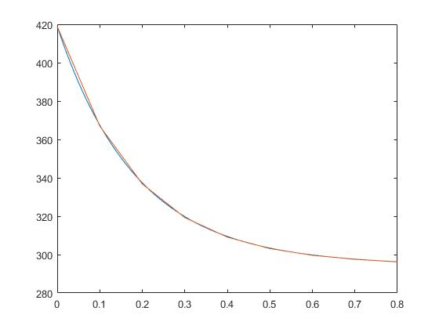

## MATLAB

Even with so many languages, there is no escaping MATLAB. I am proficient in MATLAB and can appreciate it for its unparalleled GUI capabilities when exploring new data. The example below describes 1-dimensional single fin heat transfer using experimental data and comparing it to analytical. 

 
[Link to Repository](https://github.com/mhatzi/matlab1DHT) 
[Go Back](https://mhatzi.github.io/)

