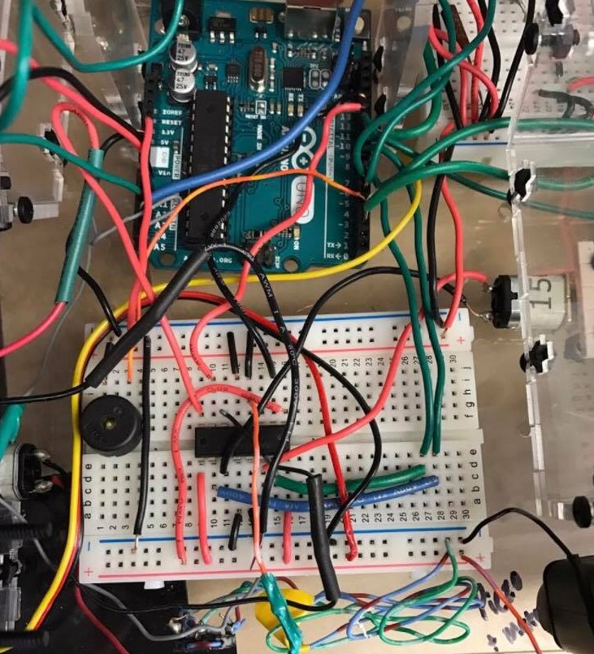

**Mechatronics Objective:** The objective of this device was to obtain as many 1" blocks as possible, sort via color and deposit in to respective bins, while competing against your peers for the most blocks in the least amount of time. In addition, participants were only allowed 2 sq feet of plastic sheeting and were not allowed to use any fasteners aside from screws. 

()</a>

 
()</a>

