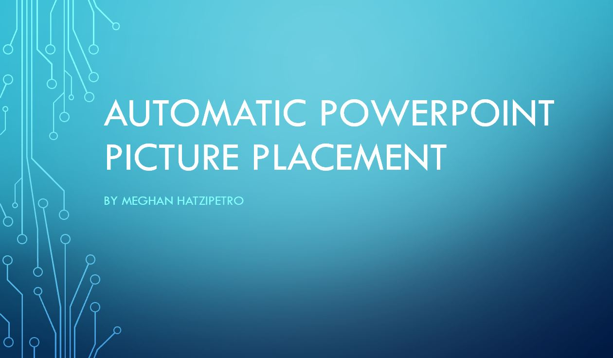

## Python

I enjoy most of my data processing in python and am currently exploring the concepts of machine learning. Although this section mainly focuses on MatPlotLib & PyPPTX, I also use many other libraries, like those listed below. 
BeautifulSoup|Numpy|SciPy|Scikit-Learn|PPTX|Pandas|Apache Spark|TensorFlow|Keras|SQLAlchemy

**Powerpoint Automation Tool:** Often at work, you find yourself fiddling with dragging pictures in to powerpoint. This process is easy but after 20 slides, moving them <i>a little to the left</i> can soon waste a day. To solve this I wrote a very basic code that you are welcome to use! [Download the code here.](https://github.com/mhatzi/Python-Powerpoint-Example) This will drag each picture on to a new slide in powerpoint in alphabetical order and title each slide with the file name, underscores replaced with spaces. You're welcome to try it for yourself and modify to your needs. This is ideal for daily status meetings. 
 

**Introduction to Matplotlib:** Having had little to no formal coding classes myself, I understand the struggle of learning a new programming language. Though, having successfully overcome that challenge, I understand the need for a powerful processor. In my experience, many resort back to other programs when they need to get things done quickly. In an attempt to correct this, I created this cheat sheet such that hopefully someone completely new at python might be able to quickly plot up data. 
 
I've also provided my jupyter notebook in an attempt to make things easier.

 
[Link to Download](https://github.com/mhatzi/MatplotlibGuide)
 
[Go Back](https://mhatzi.github.io/)

