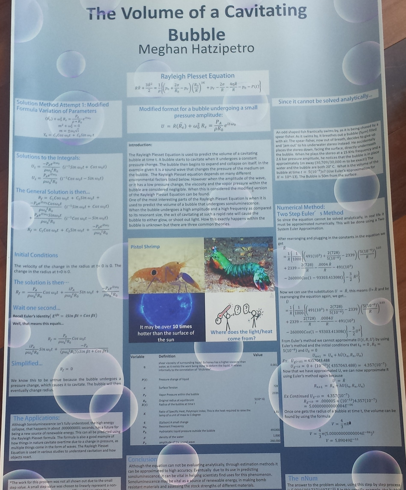
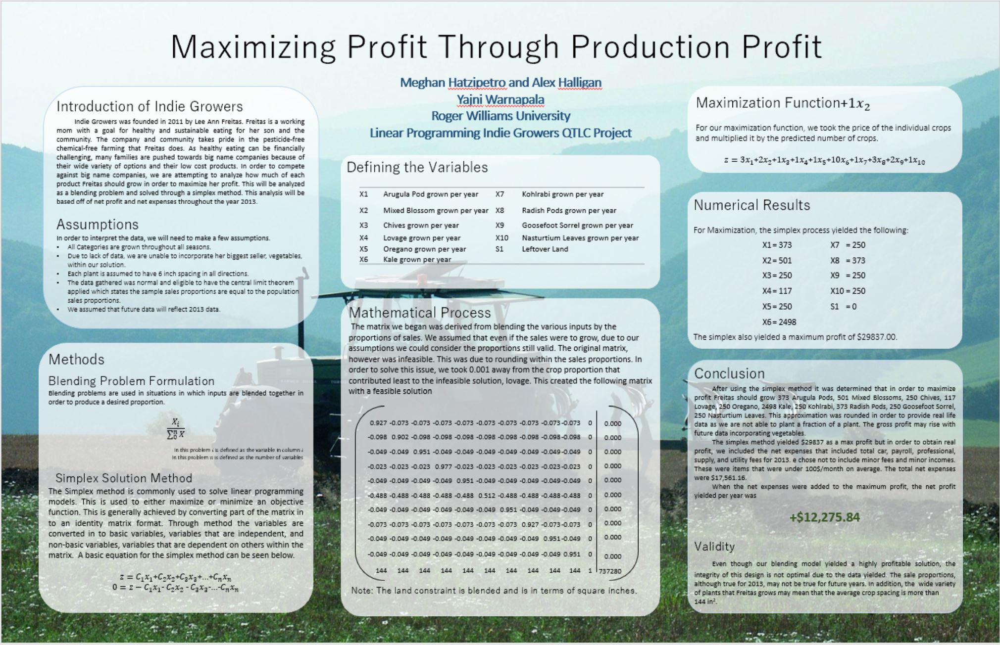

## Distinguished Presenter in Academic Showcases

I have been selected twice as a distinguished presented in the Student Academic Show Case at Roger Williams University. My first presentation was an evaluation of the Rayleigh Plesset Equation for a bubble undergoing sono-luminescent cavitation. The the latter showcase, my partner and I optimized a local farms crop areas in an attempt to maximize thier profits via land usage.  

  
[Go Back](https://mhatzi.github.io/)
