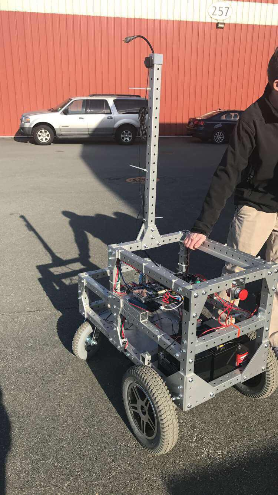
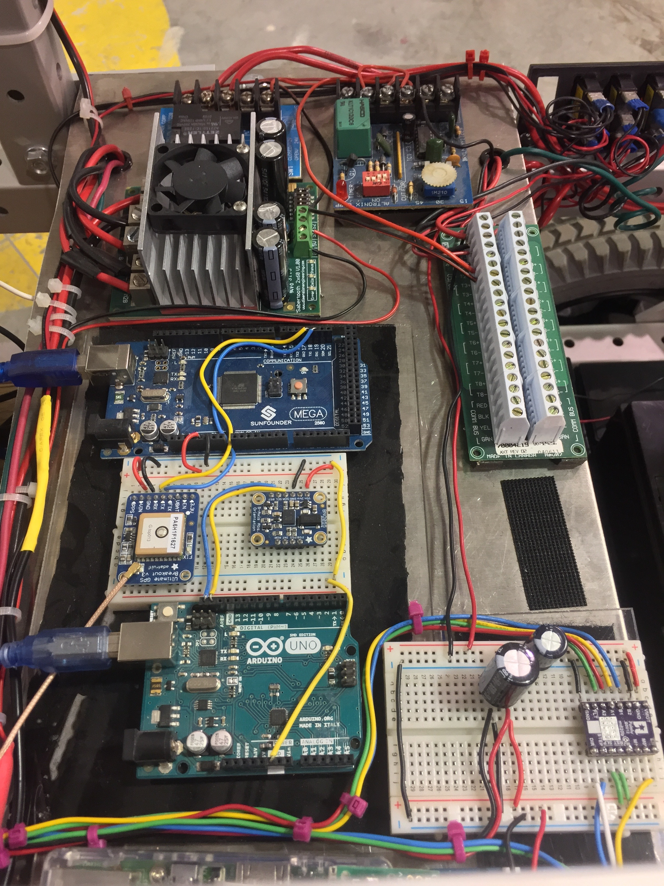

## Intelligent Ground Vehicle, 2017

**Description:** The Intelligent Ground Vehicle Competition (IGVC) is an annual international multidisciplinary robotics competition held at Oakland University in Rochester, Michigan. In the competition’s 25th year, The Roger Williams University(RWU) IGVC team competed Sparky, for the first time in one of its most popular events, the Basic Autonomous Navigation Course. He utilized LIDAR and cameras mounted to a stepper motor to give him at 180 degree range of vision. Sparky received 6th place and Rookie of the Year. 
[Go Back](https://mhatzi.github.io/) 
 

 

