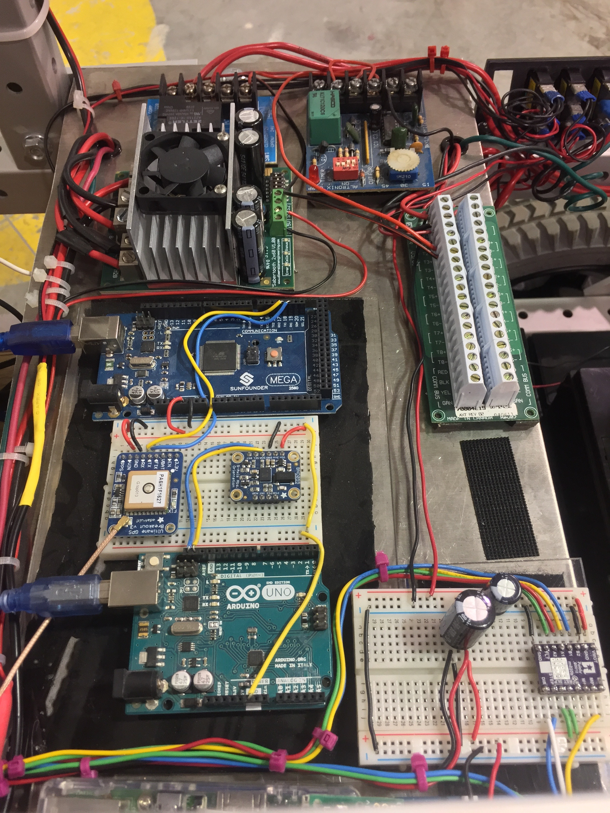

## Portfolio

---

### Robotics 

[Intelligent Ground Vehicle](/Sparky.md)
<a href="/Sparky.html">()</a>
<!--  -->

---
[Mechatronics](/Mechatronics.md)

---
[Miscellaneous](/pdf/sample_page.md)

---
### Python Codes
[How To Plot Cheat Sheet](/matplotlib_jupyter.md)

---

---

### Awards & Recognition
- [Distinguished Presenter](http://example.com/)
- [Excellence in Engineering](http://example.com/)
- [TALON Award](http://example.com/)
- [Passed Fundamental Engineering Exam](http://example.com/)

---

---

Page template forked from <a href="https://github.com/evanca/quick-portfolio">evanca</a>

<!-- Remove above link if you don't want to attibute -->
