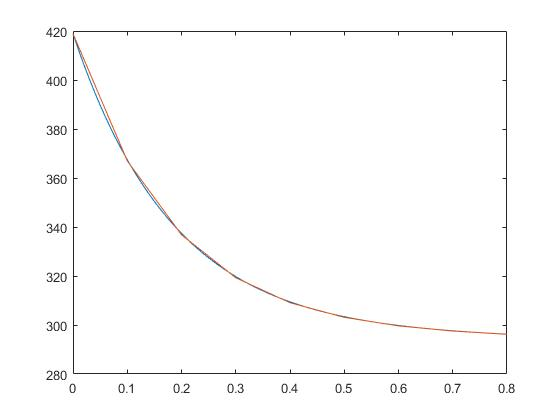

## Portfolio

---

### Robotics 

[Intelligent Ground Vehicle](/Sparky.md)

<!--  -->

---
[Mechatronics](/Mechatronics.md)

---
[Miscellaneous](/Misc.md)

---
### Example Python Code
[How To Plot Cheat Sheet](/Python.md)

---
### Example MATLAB Code
[1 Dimmensional Fin Heat Transfer](/MATLAB.md)

 
---
### Awards & Recognition
- [Distinguished Presenter](http://example.com/)
- [Excellence in Engineering](/EngineeringExcellence.md)
- [TALON Award](/TALON.md)
- [Passed Fundamental Engineering Exam](/FE.md)

---

---

Page template forked from <a href="https://github.com/evanca/quick-portfolio">evanca</a>

<!-- Remove above link if you don't want to attibute -->
