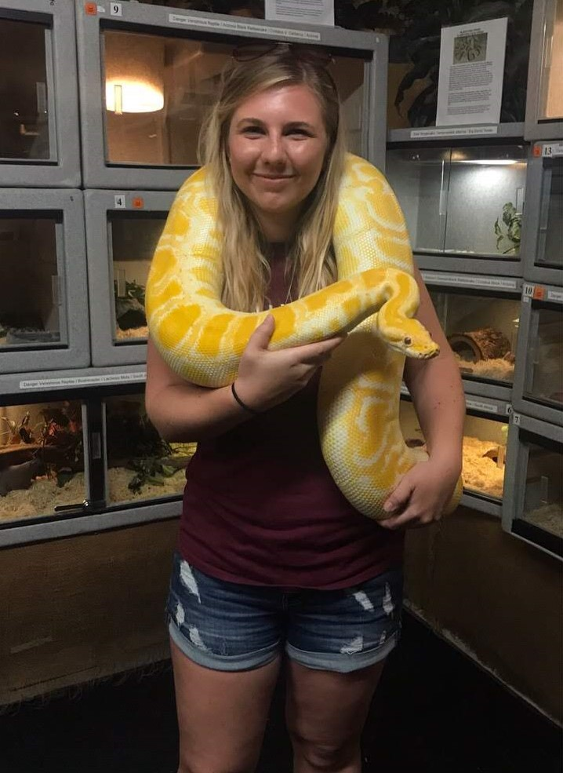

# About Me

I've been told no matter where I'm placed, I'll always be happy, and for the most part - that's true. 
This is in part because I'm a bit of a goofball but  in large because of my wide range of hobbies. I enjoy
everything from motorsports and skiing to gardening and baking. Although I tend to follow the motto 
<i>"Jack of all trades master of none,"</i> I may have mastered my baklava skill.  

 
 
 

 
 
[Go Back](https://mhatzi.github.io/)
